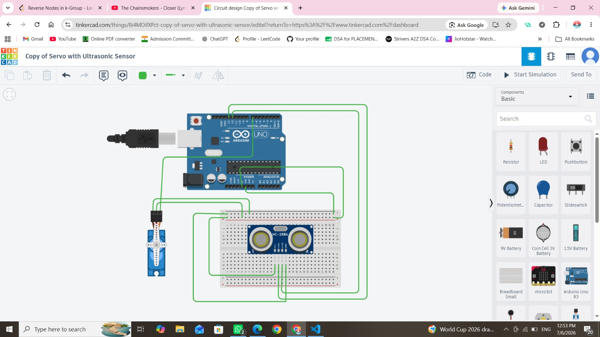

# 🗑️ SmartDispatch: IoT Waste Management & CV Detection

An advanced IoT-powered waste management dashboard featuring 3D depth sensors, circular masking, YOLOv8 human hatch gatekeepers, and safety alarms.

---

## 📡 Live System Indicators

| 🟢 3D Depth Radar | 👤 YOLO Human Hatch Scan | 🔥 Emergency Thermal Scan |
| :---: | :---: | :---: |
| <svg xmlns="http://www.w3.org/2000/svg" viewBox="0 0 100 100" width="100" height="100"><circle cx="50" cy="50" r="45" fill="none" stroke="#10b981" stroke-width="0.5" stroke-dasharray="2 2" /><circle cx="50" cy="50" r="30" fill="none" stroke="#10b981" stroke-width="0.5" stroke-dasharray="2 2" /><circle cx="50" cy="50" r="15" fill="none" stroke="#10b981" stroke-width="0.5" stroke-dasharray="2 2" /><line x1="50" y1="5" x2="50" y2="95" stroke="#10b981" stroke-width="0.2" /><line x1="5" y1="50" x2="95" y2="50" stroke="#10b981" stroke-width="0.2" /><path d="M50 50 L50 5 A45 45 0 0 1 81.8 18.2 Z" fill="url(#sweepGrad)"><animateTransform attributeName="transform" type="rotate" from="0 50 50" to="360 50 50" dur="4s" repeatCount="indefinite" /></path><defs><linearGradient id="sweepGrad" x1="1" y1="1" x2="0" y2="0"><stop offset="0%" stop-color="#10b981" stop-opacity="0.45" /><stop offset="100%" stop-color="#10b981" stop-opacity="0" /></linearGradient></defs></svg> | <svg xmlns="http://www.w3.org/2000/svg" viewBox="0 0 100 100" width="100" height="100"><rect x="15" y="15" width="70" height="70" rx="10" ry="10" fill="none" stroke="#6ee7b7" stroke-width="1.5" /><line x1="15" y1="20" x2="85" y2="20" stroke="#34d399" stroke-width="3"><animate attributeName="y1" values="20;80;20" dur="2.5s" repeatCount="indefinite" /><animate attributeName="y2" values="20;80;20" dur="2.5s" repeatCount="indefinite" /></line><circle cx="50" cy="38" r="8" fill="#6ee7b7" /><line x1="50" y1="46" x2="50" y2="63" stroke="#6ee7b7" stroke-width="3" /><line x1="50" y1="63" x2="42" y2="76" stroke="#6ee7b7" stroke-width="2.5" /><line x1="50" y1="63" x2="58" y2="76" stroke="#6ee7b7" stroke-width="2.5" /><line x1="50" y1="52" x2="38" y2="58" stroke="#6ee7b7" stroke-width="2.5" /><line x1="50" y1="52" x2="62" y2="58" stroke="#6ee7b7" stroke-width="2.5" /></svg> | <svg xmlns="http://www.w3.org/2000/svg" viewBox="0 0 100 100" width="100" height="100"><circle cx="50" cy="50" r="40" fill="none" stroke="#ef4444" stroke-width="3"><animate attributeName="r" values="32;44;32" dur="2s" repeatCount="indefinite" /><animate attributeName="stroke-opacity" values="1;0;1" dur="2s" repeatCount="indefinite" /></circle><circle cx="50" cy="50" r="30" fill="none" stroke="#ef4444" stroke-width="3.5" /><path d="M50 25 L70 65 L30 65 Z" fill="#ef4444" /><text x="50" y="60" fill="white" font-size="11" font-weight="bold" text-anchor="middle">!</text></svg> |
| Scanning Depth Mesh | YOLO Stick-Person Scan | HSV Heat & Smoke Pulse |

---

## 🛠️ Project Modules

### 1. 🐍 Computer Vision (`CV/`)
* **`depth_sender.py`**:
  Loads `test1.png`, applies **Gaussian smoothing** and **circular bin masking**, downsamples grids, writes a colorized telemetry preview image (`depth_live_1.png`), and uploads coordinates.
* **`security_detector.py`**:
  Uses **YOLOv8** to check for humans. Opens the hatch only for humans (ignores animals/vehicles).
* **`fire_smoke_detector.py`**:
  Performs **HSV color checks** for heat/smoke indicators, rings motherboard buzzers on detection, and submits emergency safety alerts.

### 2. 🚀 API Backend (`server/`)
* **Express & Node.js** backed by **PostgreSQL** (Neon).
* Cache controllers storing meshes and security warnings.

### 3. 💻 Web Dashboard (`client/`)
* **React & Vite** styled with glassmorphism dark-themes.
* Centered popup visualizer showing dynamic colorbar scales and interactive 3D meshes with zoom selectors (`+`/`−`).

---

## 🔌 Hardware Components

<p align="center">
  
</p>

* **Arduino Uno**: The brain microcontroller board that collects inputs from the sensors and commands the output actuators.
* **Ultrasonic Sensor (HC-SR04)**: Measures the distance inside the bin by sending high-frequency sonar pulses, used to gauge waste levels.
* **Servo Motor (SG90)**: The physical lid actuator that rotates to swing the dustbin hatch open and closed.
* **GSM Module (SIM800L)**: The cellular transceiver used to send SMS warnings or mobile data alerts directly to waste management dispatch crews.

---

## 🏃 Run Instructions

Start the database backend, client portal, and CV scripts:

```bash
# 1. Run Node.js API server
cd server && npm start

# 2. Run React portal
cd client && npm run dev

# 3. Run Depth Scanner
cd CV && python depth_sender.py

# 4. Run YOLO gatekeeper
cd CV && python security_detector.py

# 5. Run Fire/Smoke monitor
cd CV && python fire_smoke_detector.py
```
